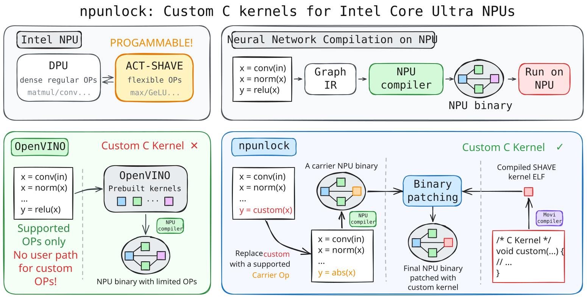

# npunlock



`npunlock` lets you run operations on Intel Core Ultra NPUs that are not supported by the normal software stack. You write the operation in C, use it alongside a regular neural-network graph, and `npunlock` turns the result into an NPU program that runs on the device. `npunlock` has been verified for Windows x64 with Meteor Lake / NPU3720. 

## Quick example

This complete FP32 GELU example embeds the C kernel in Python, places it in an
NPU graph, and checks the result against NumPy. The bundled
`npunlock/npu3720_kernel.h` target header supplies the NPU3720 invocation and
tensor-address helpers.

```python
import numpy as np
import npunlock as npu

npu.configure(movi_dll_dir=r"C:\path\to\MVC_DEPEND")

gelu_c: bytes = b"""
#define MLIBM_DEFINE_LINK_COMPAT 1
#include <npunlock/npu3720_kernel.h>

void controlled_act(unsigned layerParams) {
    act_abi_invocation invocation;
    ACT_ABI_LOAD_INVOCATION32_OR_RETURN(layerParams, invocation);
    const float *in = ACT_ABI_INPUT_PTR32(const float, invocation, 0u);
    float *out = ACT_ABI_OUTPUT_PTR32(float, invocation, 1u);
    const float SQRT_2_DIV_PI = 0.7978845608028654f;
    for (unsigned i = 0; i < invocation.element_count; ++i) {
        float x = in[i];
        float w = x + 0.044715f * x * x * x;
        w = tanhf(w * SQRT_2_DIV_PI);
        out[i] = 0.5f * x * (1.0f + w);
    }
}
"""

N = 2048
x = npu.input("x", shape=(1, N), dtype="f32")
y = npu.custom(
    x,
    source=gelu_c,
    carrier="Abs",
    _shape=x.shape,
    _dtype=x.dtype,
    _name="y",
)

program = npu.compile(npu.Graph(inputs=[x], outputs=[y], name="gelu_f32_example"))

input_value = np.linspace(-4, 4, N, dtype=np.float32).reshape(1, -1)
output = program.run({"x": input_value})["y"]
reference = 0.5 * input_value * (
    1.0
    + np.tanh(
        np.sqrt(2.0 / np.pi)
        * (input_value + 0.044715 * input_value**3)
    )
)
print(f"maximum absolute error: {np.max(np.abs(output - reference)):g}")
```

The same code is available as the runnable
[FP32 GELU example](examples/example_gelu_f32.py). See also the
[FP16 GELU](examples/example_gelu.py) and
[multi-layer two-input](examples/example_multilayer_multi_input.py) examples.

## Why npunlock?

Intel's normal NPU software accepts graphs made from operations its compiler
supports; it does not expose a public workflow for supplying a C implementation
for an operation. The NPU's ACT-SHAVE processors are programmable and run
software kernels. `npunlock` makes those processors usable for compatible
custom graph operations while retaining Intel's compiler and driver for the
surrounding graph and hardware execution.

## Requirements

- Windows x64
- Meteor Lake / Intel NPU3720
- an installed Intel NPU driver for the device
- Python 3.10 or newer
- CMake 3.24 or newer and an installed MSVC toolchain for source installation
- the extracted MoviTools `MVC_DEPEND` toolchain for custom C compilation

OpenVINO is not required as a runtime, Python package, or compiler frontend.
`npunlock` does emit OpenVINO-format IR for the installed Intel driver.

## Install

`npunlock` is currently installed from a source checkout:

```powershell
python -m pip install .
```

The build bundles `npunlock.dll` and `npunlock_worker.exe` inside the Python
package, so normal Python use does not require a separate native path.

## Get MoviTools

Custom C compilation uses Intel/Movidius MoviTools, which `npunlock` does not
redistribute or download. Extract the `MVC_DEPEND` payload from Lenovo's older
Intel NPU driver package `31.0.100.1688`, but **do not install or downgrade to
that driver**.

Keep the two roles separate:

```text
installed Intel NPU driver
  -> graph compilation, Level Zero, and hardware execution

extracted Lenovo 31.0.100.1688 package
  -> MoviTools compiler files only
  -> not installed
```

See [Getting MoviTools](wiki/GET_MOVITOOLS.md) for the official download,
hash, extraction command, and expected layout.

## Run an example

Point `npunlock` at the extracted `MVC_DEPEND` root and run GELU:

```powershell
$env:NPUNLOCK_MOVITOOLS_DIR = 'C:\path\to\MVC_DEPEND'
python examples\example_gelu.py
```

The example runs on the NPU and reports its maximum error against a NumPy
reference.

## What currently works

- compile user-written C into ACT-SHAVE machine code
- run custom kernels inside Intel NPU graphs
- static dense FP16 unary and two-input custom kernels
- a verified unary FP32 path
- nonlinear math such as GELU and `tanhf`
- Python, CLI, and native C APIs

## Current limitations

Support is experimental and currently limited to Windows x64, Meteor Lake /
NPU3720, static shapes, compatible ACT carriers, and known tensor layouts.
Other NPU generations have not been verified. See
[Current limitations](wiki/LIMITATIONS.md) for the full compatibility boundary.

## Help test Linux and newer NPUs

Have an NPU3720 Linux system or a newer Intel NPU? Contributions are welcome.
Two routes look especially promising but remain untested:

- a patched NPU3720 graph produced on Windows may run on Linux because the NPU
  firmware executes the custom machine code; building SHAVE code on Linux would
  additionally require a way to load the Windows MoviTools DLLs;
- newer NPUs may execute the existing `3720xx` SHAVE image, or an older OEM
  driver package for that generation may provide matching MoviTools components.

Both need hardware validation, driver/firmware version records, and output
comparison against a host oracle. If you can test either path, feedback, failure
reports, and code contributions are welcome. See
[Porting to Linux and newer NPUs](wiki/PORTING.md) for the hypotheses, caveats,
and a suggested test plan.

## Documentation

- **[Getting MoviTools](wiki/GET_MOVITOOLS.md)** — obtain the compiler toolchain without installing the legacy driver
- **[Python API](wiki/PYTHON_API.md)** — construct, compile, and execute graphs from Python
- **[Writing custom kernels](wiki/CUSTOM_KERNELS.md)** — C entry point, tensor contract, and examples
- **[How npunlock works](wiki/HOW_NPUNLOCK_WORKS.md)** — graph compilation and custom-kernel integration
- **[From model to machine code](wiki/MODEL_TO_MACHINE_CODE.md)** — step-by-step lowering and the components involved
- **[Intel NPU architecture](wiki/INTEL_NPU_ARCHITECTURE.md)** — DPU and ACT-SHAVE overview
- **[Current limitations](wiki/LIMITATIONS.md)** — verified hardware and ABI scope
- **[Porting to Linux and newer NPUs](wiki/PORTING.md)** — experimental routes and contribution guide
- **[Development and native APIs](wiki/DEVELOPMENT.md)** — CMake, testing, packaging, CLI, and C interfaces
- **[Full documentation index](wiki/README.md)**

## License

`npunlock` is licensed under the [Apache License 2.0](LICENSE). MoviTools and
the Intel/Movidius libraries are external proprietary dependencies and are not
covered or redistributed by this repository.
